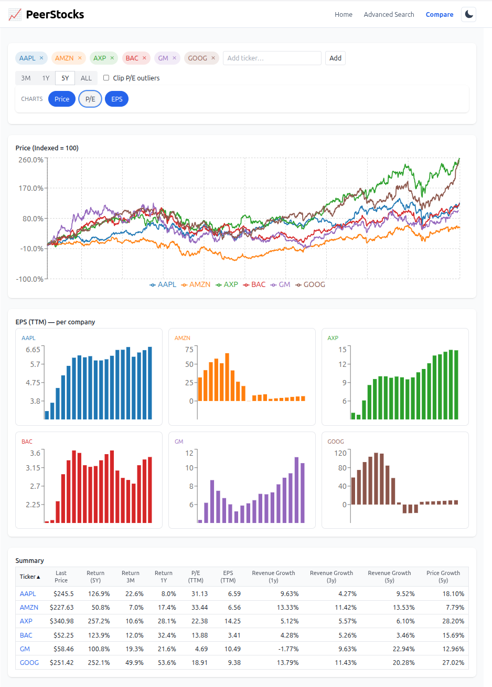

# PeerStocks

[](https://peerstocks.com)

A peer comparison dashboard for equities. Add multiple tickers and compare their *Price (indexed)*, *P/E*, and *EPS (TTM)* at a glance.  
Backend API + ingest jobs + OpenSearch for data; React frontend for the UI.



## Demo

🚀 Try it live here: [peerstocks.com](https://peerstocks.com)


## Features
- Compare multiple tickers side‑by‑side
- Charts: Price (indexed), P/E, and EPS (TTM)
- Per‑company mini‑charts and a sortable summary table
- Lightweight ingestion jobs to seed symbols and fetch updates
- Dockerized services for easy local dev and production

## Requirements
- Docker & Docker Compose
- Node 18+ (only if running the dev frontend with `npm start`)

## 1) Configure environment

```bash
cp .env.sample .env
```

Edit **.env** and set at least:

- `APP_ENV`: `dev` or `prod`
- OpenSearch password: `OS_PASS`
- OpenSearch data & log directories: `OS_DATA_DIR`, `OS_LOG_DIR`
- Provider keys: `POLYGON_API_KEY`, `OPENAI_API_KEY`

## 2) Build docker images

```bash
docker build -t backend:latest   backend
docker build -t ingest:latest    ingest
docker build -t frontend:latest  --build-arg REACT_APP_API_BASE_URL=/api frontend
```

## 3) Run (production)

```bash
docker compose -f compose.prod.yml up
# open: http://localhost
```

## 4) Run (development)

Run **OpenSearch in Docker**, and the **backend + frontend on the host** for fast reload:

```bash
# Start OpenSearch only
docker compose -f compose.dev.yml up opensearch

# Backend on host (hot reload)
source ./dev_env.sh
cd backend && uvicorn backend.main:app --reload

# Frontend on host (hot reload)
cd frontend && npm ci && npm start
# open: http://localhost:3000
```

## 5) Data ingestion

Use the wrapper scripts (they pick the correct compose file based on `APP_ENV`). Place your tickers list under `ingest/`.

```bash
./init_indices.sh                     # create OpenSearch indices with mappings
./seed_tickers.sh ingest/tickers.txt  # seed new tickers
./fetch_prices.sh ingest/tickers.txt  # fetch latest prices
./fetch_earnings.sh ingest/tickers.txt # fetch latest earnings
```
> ⚠️ **Important:**  
> Do **not** run queries from the frontend until the required OpenSearch indices have been created and initialized.  
> If queries are executed too early, OpenSearch may auto-create indices with incorrect mappings.  
> This can corrupt your data model and cause index creation with the proper mapping to fail later.


## License

This project is licensed under the [MIT License](LICENSE).
